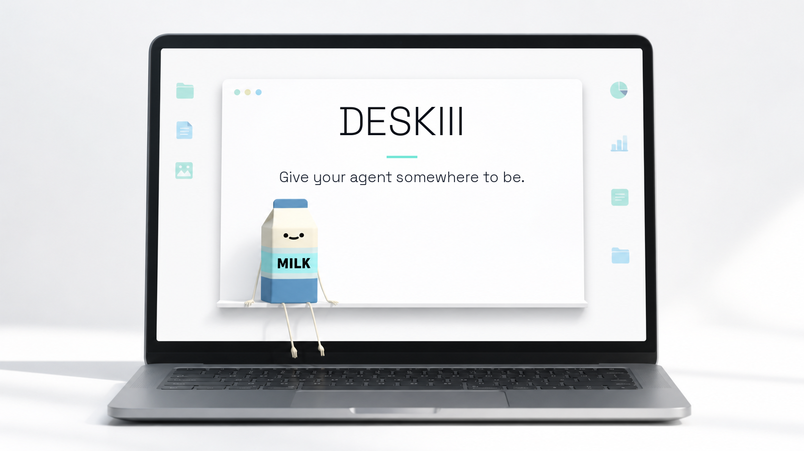

<div align="center">

  

  <h3>Your AI agent, alive on your desktop.</h3>

  <p>An expressive 3D desktop companion interface for the AI agents you already use.</p>

  <p>
    <a href="https://img.shields.io/badge/TypeScript-007ACC?style=for-the-badge&logo=typescript&logoColor=white"></a>
    <a href="https://img.shields.io/badge/React_19-20232A?style=for-the-badge&logo=react&logoColor=61DAFB"></a>
    <a href="https://img.shields.io/badge/Electron-47848F?style=for-the-badge&logo=electron&logoColor=white"></a>
    <a href="https://img.shields.io/badge/Three.js-000000?style=for-the-badge&logo=three.js&logoColor=white"></a>
    <a href="https://img.shields.io/badge/Windows-0078D6?style=for-the-badge&logo=windows&logoColor=white"></a>
    <a href="https://img.shields.io/badge/macOS-000000?style=for-the-badge&logo=apple&logoColor=white"></a>
  </p>

  <p>
    <a href="https://img.shields.io/badge/License-Proprietary-red?style=for-the-badge"></a>
    <a href="https://img.shields.io/badge/Tests-562%20Passing-brightgreen?style=for-the-badge"></a>
    <a href="https://deskii.app"></a>
  </p>

  <br>

  

  <br><br>

</div>

---

## 💡 The Inspiration & Vision

Remember **Clippy** or classic desktop companions? They were charming, but static and unhelpful.

**Deskii** re-imagines the desktop companion for the modern AI agent generation. Instead of living inside yet another web browser tab or terminal window, your AI agents (OpenClaw, Codex, Hermes, Claude) get a physical, living embodied presence right on your desktop.

- **Any Avatar:** Bring Milk (the founding mascot), VRoid studio avatars, or custom 3D VRM 0.x/1.0 characters to life.
- **State-Driven Realism:** When your agent is reasoning, running shell commands, executing tools, or speaking, the avatar expresses those exact states in real time.
- **Ambient & Unobtrusive:** Sits quietly at the edge of your screen with transparent click-through, popping up speech bubbles and approval prompts only when needed.

---

## 🎬 Product Demo & Preview

> 📹 **Watch the Deskii Preview Reel:** Visit [https://deskii.app](https://deskii.app) to see Deskii in action with full voice streaming, ambient motion, and live agent tool approval gates.

```text
Agent Runtime (OpenClaw / Codex / Hermes / Claude)
                    │
                    ▼
     [ Agent Adapter Layer (IPC Isolated) ]
                    │
                    ▼
     [ Deskii Event Protocol & State Machine ]
                    │
                    ▼
     [ 3D Avatar Engine & Desktop Companion Surface ]
```

---

## ✨ Key Features

- 🧠 **Runtime Neutral (Bring Your Own Agent)** — Connect OpenClaw, Codex, Hermes, or Claude. Deskii acts as the universal desktop client for whichever agent you choose.
- 🎙️ **Conversational Voice Engine** — Natural full-duplex voice input and speech synthesis, live streaming transcripts, speech viseme lip-sync, and barge-in audio interruption.
- 🎭 **Expressive 3D VRM Avatars** — Full VRM 0.x and 1.0 humanoid avatar rendering with procedural pose blending, Quaternius & Mixamo motions, and autonomous ambient cadences.
- 🪟 **Desktop Companion Windowing** — Frameless, transparent, draggable, and resizable window positioning clamped to your monitor layout. Supports pass-through clicks and system tray recovery.
- 🔒 **Interactive Tool Approval Safety Gate** — Human-in-the-loop protection. Review and approve or deny agent file system access, shell commands, or network calls directly from the desktop companion bubble.
- 🛡️ **Zero-Trust Security Architecture** — Credentials, tokens, and API keys are strictly isolated in Electron's main process and encrypted via OS-level secure storage (`contextIsolation: true`, `nodeIntegration: false`).

---

## 🔌 Supported Agent Runtimes

Deskii normalizes events across multiple agent runtimes into a single companion state machine (`disconnected`, `idle`, `listening`, `thinking`, `working`, `approval`, `speaking`, `success`, `error`):

| Runtime | Integration Type | Key Capabilities |
|---|---|---|
| **OpenClaw** | Gateway WebSocket (Protocol v4) | Encrypted device pairing, real-time voice streaming, tool execution, remote/local gateways |
| **Codex** | Local App Server / CLI | Workspace grants, local execution policy, shell tool approvals |
| **Hermes** | API Protocol / Vault | Secure token vault, protocol-level state tracking, session management |
| **Claude** | Agent SDK | CLI executable discovery, agent session streaming, tool authorization |

---

## 🚀 Roadmap & Future Ecosystem

Deskii is building towards a creator-first avatar ecosystem and agent-native commerce infrastructure:

```text
┌───────────────────────────┐      ┌───────────────────────────┐      ┌───────────────────────────┐
│   Phase 1: Core Client    │ ───► │  Phase 2: Creator Market  │ ───► │  Phase 3: x402 Commerce   │
│ Multi-Agent + 3D Companion│      │ Avatar & Motion Packs     │      │ Agent-Initiated Rentals   │
└───────────────────────────┘      └───────────────────────────┘      └───────────────────────────┘
```

### 1. 🎨 Avatar & Motion Pack Marketplace
We are opening up the Deskii platform so 3D artists, animators, and character creators can:
- **Publish & Sell:** Upload custom VRM avatars, outfits, accessories, and motion-personality packs.
- **Creator Monetization:** Earn direct revenue or royalties when users adopt or license your companion designs.
- **Machine-Readable Provenance:** Built-in cryptographic SHA-256 asset provenance and licensing sidecars.

### 2. ⚡ x402 Agent Commerce & NFT Licensing Rails
Unlocking true machine-to-machine micro-transactions and verifiable digital ownership:
- **Autonomous Agent Rentals:** Your AI agent can programmatically rent a specialized avatar or custom motion pack using **x402 micro-payment rails** on-chain, use it for a session, and release it automatically.
- **Manual User Rentals & Purchases:** Users can manually purchase or rent companions using credit/debit or Web3 wallets (MetaMask integration with zero private-key exposure).
- **NFT Ownership & License Proof:** Verifiable on-chain license NFTs ensuring artists retain rights while users hold authentic asset entitlement proofs.

---

## 🛠️ Local Development & Setup

**Prerequisites:** Node.js ≥ 22.0.0, npm ≥ 11.0.0 on Windows 10/11 or macOS.

```powershell
# Clone repository
git clone https://github.com/vmbbz/Desky.git
cd Desky

# Install dependencies
npm install

# Start in development mode
npm start
```

### Quality & Verification Matrix

```powershell
# Run code linter
npm run lint

# Run TypeScript typechecks
npm run typecheck

# Run full test suite (562 passing tests)
npm test

# Build production executable package
npm run package
```

---

## 📖 Documentation Index

| Document | Description |
|---|---|
| [PRODUCT.md](docs/PRODUCT.md) | Product vision, target users, jobs to be done, and experience model |
| [ADAPTERS.md](docs/ADAPTERS.md) | Universal agent adapter architecture and runtime event normalization |
| [COMPANION-EXPERIENCE.md](docs/COMPANION-EXPERIENCE.md) | Desktop windowing, positioning, interaction bounds, and accessibility |
| [ARCHITECTURE.md](docs/ARCHITECTURE.md) | System architecture, main/renderer process isolation, and IPC bridges |
| [AVATAR-MARKETPLACE.md](docs/AVATAR-MARKETPLACE.md) | Avatar marketplace, creator royalties, and licensing specification |
| [COMMERCE-ENTITLEMENTS.md](docs/COMMERCE-ENTITLEMENTS.md) | x402 on-chain payment rails, entitlement validation, and NFTs |
| [ANIMATION-PIPELINE.md](docs/ANIMATION-PIPELINE.md) | 3D VRM 0.x/1.0 loading, FBX clip converter, and motion arbitration |
| [OPENCLAW.md](docs/OPENCLAW.md) | OpenClaw gateway protocol, device auth, and voice integration |
| [SECURITY.md](docs/SECURITY.md) | Process isolation, CSP policy, credential vault, and tool approval gates |
| [ASSETS.md](docs/ASSETS.md) | Avatar provenance, licensing metadata, and asset broker policy |
| [DISTRIBUTION.md](docs/DISTRIBUTION.md) | Release profiles (Microsoft Store free vs direct-download signed) |
| [THIRD_PARTY_NOTICES.md](THIRD_PARTY_NOTICES.md) | Open-source dependencies and third-party asset licensing notices |

---

## ⚖️ Licence & Rights

Deskii is **proprietary software** owned and published by **XEON Protocol (Pty) Ltd**.

- Source code in this repository is accessible for security auditing and transparency only. You may **not** copy, fork, redistribute, sublicense, or build derivative commercial products without explicit written authorization.
- The compiled application is licensed under the [Deskii End-User Licence Agreement (EULA)](https://deskii.app/terms).
- Third-party open-source libraries incorporated in Deskii retain their respective licences (see [`THIRD_PARTY_NOTICES.md`](./THIRD_PARTY_NOTICES.md)).

Full licence text: [`LICENSE.md`](./LICENSE.md)  
Legal & Licensing enquiries: [legal@deskii.app](mailto:legal@deskii.app)
